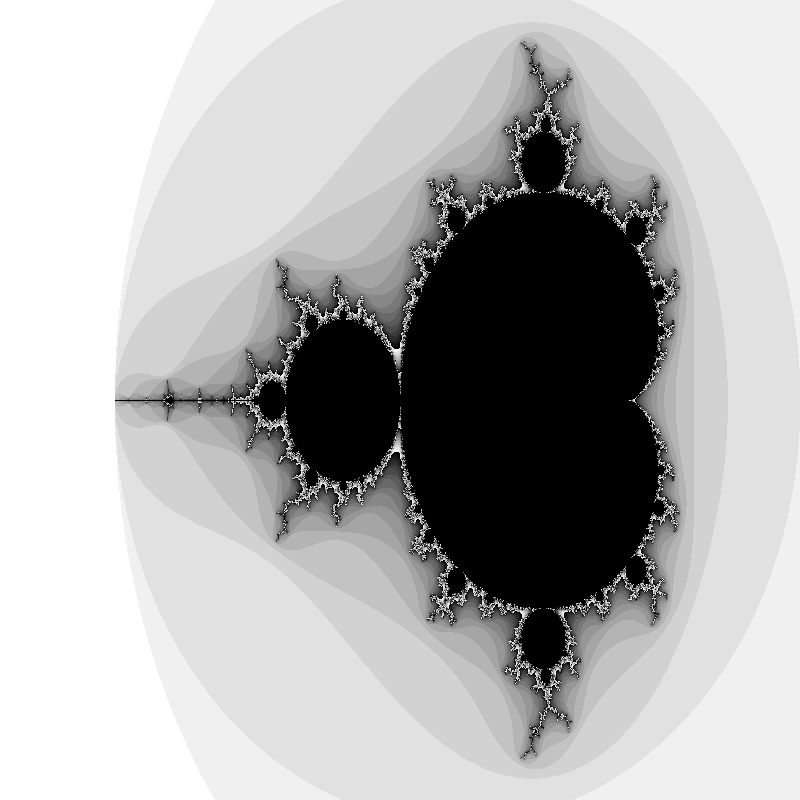

# goFractal

## Description

The `goFractal` library is a Go package for generating fractals. This library provides support for both PNG and GIF formats. You can specify the focus points and zoom level for more detailed fractals.

## Installation

To install the package, run:

```bash
go get -u github.com/leorighi/goFractal
```

## Usage

### Import the Package

First, import the package in your Go file:

```go
import "github.com/leorighi/goFractal"
```

### Initialize Mandelbrot struct

Initialize a new Mandelbrot struct with your preferred dimensions:

```go
m := &goFractal.Mandelbrot{
    Width:  800,
    Height: 800,
}
```

### Generate PNG Image

To generate a PNG image:

```go
err := m.GeneratePNG("mandelbrot.png", 0.0, 0.0)
if err != nil {
    return err
}
```

### Generate GIF Animation

To generate a GIF animation:

```go
err := m.GenerateGIF("output.gif", 30, -1.4017, 0.0, 0.20)
if err != nil {
    // Handle error
}
```

## Methods

### GeneratePNG

Generates a PNG image file of the Mandelbrot fractal.

- `filename`: The name of the output PNG file.
- `focusX`: X-coordinate of the focus point.
- `focusY`: Y-coordinate of the focus point.

Returns an error if the operation fails.

```go
func (m *Mandelbrot) GeneratePNG(filename string, focusX float64, focusY float64) error
```

### GenerateGIF

Generates a GIF image file with animated zoom of the Mandelbrot fractal.

- `filename`: The name of the output GIF file.
- `frames`: Number of frames in the animation.
- `focusX`: X-coordinate of the focus point.
- `focusY`: Y-coordinate of the focus point.
- `zoomSpeed`: Zoom speed for animation.

Returns an error if the operation fails.

```go
func (m *Mandelbrot) GenerateGIF(filename string, frames int, focusX float64, focusY float64, zoomSpeed float64) error
```

## Contributing
Feel free to contribute to this project.